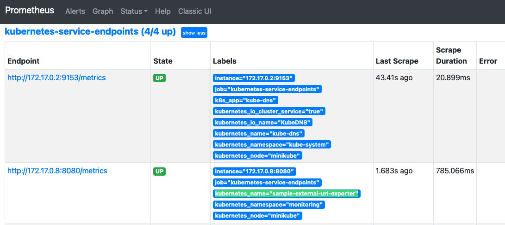
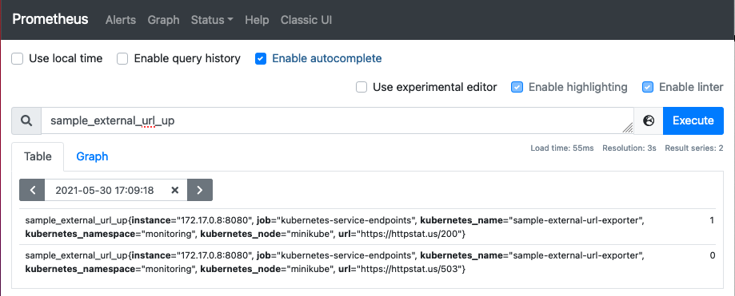
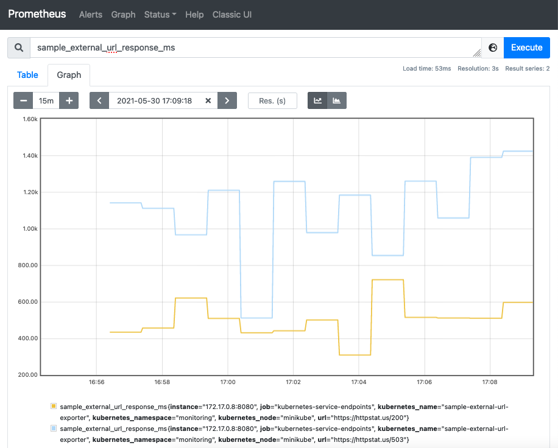
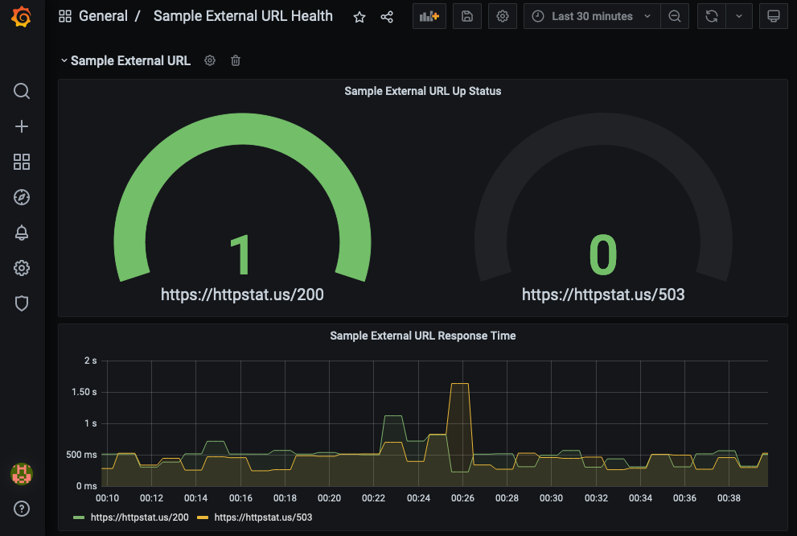

# Sample External URL Exporter for Prometheus

Exports status of external web service URLs and access response time via HTTP for Prometheus consumption.

This exporter queries 2 external urls `https://httpstat.us/503` & `https://httpstat.us/200` and check for it's up status based on the http status code 200 and the response time in milliseconds. It run a http service that produces metrics and output in Prometheus format when requesting the service on `/metrics` endpoint.

### Response format:

```
sample_external_url_up{url="https://httpstat.us/503"} 0
sample_external_url_response_ms{url="https://httpstat.us/503"} [value]
sample_external_url_up{url="https://httpstat.us/200"} 1
sample_external_url_response_ms{url="https://httpstat.us/200"} [value]
```

# Building and running

## Build binary

With working golang environment it can be built with `go build` or `go get` on the project directory. With `go build` the binary will be saved in the project directory itself, with `go get` it will be saved in the `$GOPATH/bin`.
```
go build
```

## Run

The binary doesn't accept any parameter. The service bind to the port `8080` and the metrics are exposed at `/metrics` endpoint.
```
./sample_external_url_exporter
``` 

# Using Docker

## Build image

With working docker environment you can built the docker image with `docker build .`. Docker image building is multi stage image builder, it uses intermediate container for compiling binary. You don't need a working golang environment to build docker image.
```
docker build -t sample-external-url-exporter .
```

## Tag and push image

Tag the image with your private or public registry repository and push it to the remote docker registry so it can be used in other system or k8s environment. You may have to login to the remote registry first to push the image.
```
docker image tag sample-external-url-exporter santosh0705/sample-external-url-exporter
docker image push santosh0705/sample-external-url-exporter
```

## Run

```
docker run -d -p 8080:8080 santosh0705/sample-external-url-exporter
```

# Using Kubernetes

# Deploy

The [k8s](k8s) directory holds the required manifests to deploy the exporter on a Kubernetes cluster. We can create a separate namespace to keep the monitoring related deployment separate from others. Here we are creating a namespace `monitoring`.
```
kubectl create namespace monitoring
kubectl apply -f k8s -n monitoring
```
The above commands will create a namespace `monitoring`, deploy the exporter application and expose it as service.

# Monitoring using Prometheus and Grafana

Assumed that the Prometheus and Grafana services are installed and configured in the same Kubernetes cluster in the same namespace as this exporter. Prometheus will automatically detect the exporter via a special annotation configuration and it will get added in the `kubernetes-service-endpoints` targets. Refer to the image below, you can find it with the label `kubernetes_name="sample-external-url-exporter"`.


Prometheus will start scraping metrics from the exporter as soon as it get added. Query for `sample_external_url_up` and `sample_external_url_response_ms` on Prometheus UI and you will see it appearing.



## Grafana dashboard

Import the minimalistic dashboard ([dashboard.json](grafana/dashboard.json)) created for the exporter from [grafana](grafana) directory.
Start monitoring the exporter metrics on Grafana.


## Collectors

Sample external URL metrics:

```
# HELP sample_external_url_response_ms Request response time in ms
# TYPE sample_external_url_response_ms gauge
# HELP sample_external_url_up Could the url be reached
# TYPE sample_external_url_up gauge
```

## Known caveat

The first http request made for the external URL comparatively have higher response time. This may be due to the DNS query made for the first time and later taken from the cache.

## Author

The exporter is created by [santosh0705](https://github.com/santosh0705).
